# Building and Deploying a JavaFX Application on macOS with Maven (Java 25)

https://github.com/mbachmann/HelloJavaFXWorld

This guide explains how to build, sign, notarize, and distribute a JavaFX application for macOS using **Maven**, `jlink`, `jpackage`, `codesign`, and `notarytool`. 
The goal is to create a downloadable `.dmg` disk image that runs without Gatekeeper warnings.

## The Error Messages of Downloaded Apps without signing and notarizing

With the ever-improving security of MacOS, checks on downloaded and runnable software have become more pervasive. Trying to build and distribute an application outside of the Apple App Store has its own challenges.

This guide runs you through the process of how to get this all sorted so that you aren’t going to see the following error messages.

<p float="left">
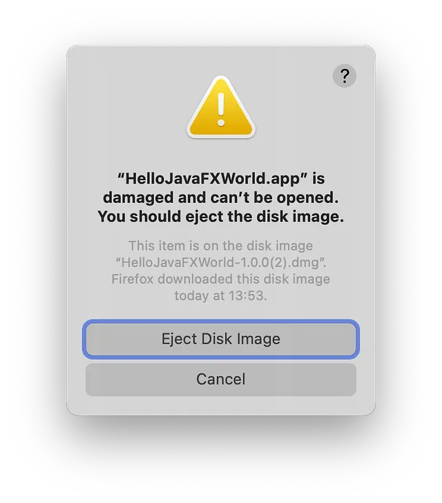
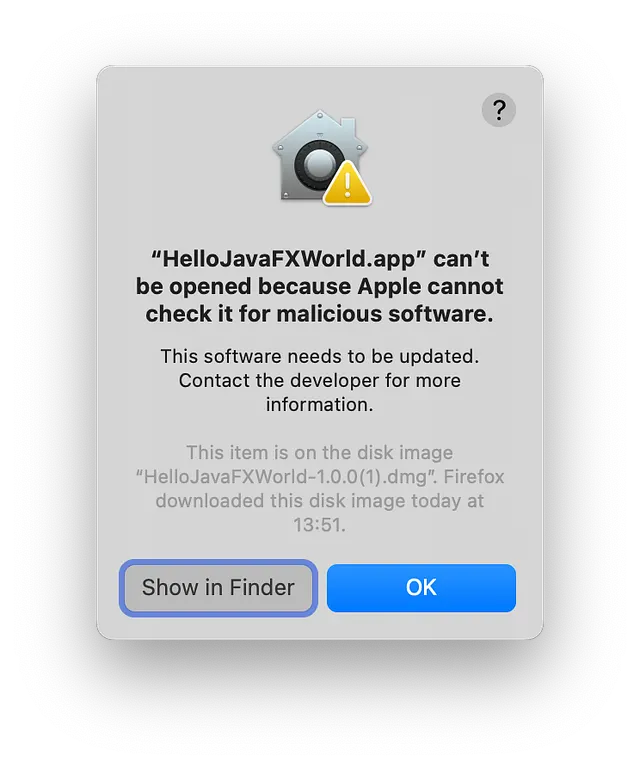
</p>

---

<br/>

## ✅ Prerequisites

- **IntelliJ IDEA (or your preferred IDE)  
  https://www.jetbrains.com/idea/download/?section=mac

- **Azul Zulu JDK with JavaFX**  
  https://www.azul.com/downloads/#downloads-table-zulu

- **Apple Developer Account** (USD $99/year)  
  https://developer.apple.com/

- **App-specific password for notarization**  
  https://appleid.apple.com/account/manage

---

## ✅ Setup Apple Developer Credentials

Go to https://developer.apple.com/ to sign up for an Apple Developer account. 
You can skip the certificate creation if you already have one.

However, make sure the necessary intermediate certificats are installed in your keychain of your macOS.

If not available, you can download it from here:

- **Download Intermediates**  
  https://www.apple.com/certificateauthority/

- **Overview of Certificates**   
  https://developer.apple.com/support/certificates/

- **Explaning the Types of Intermediates (G2, G3, ...), we need G3**  
  https://developer.apple.com/help/account/certificates/wwdr-intermediate-certificates/

  
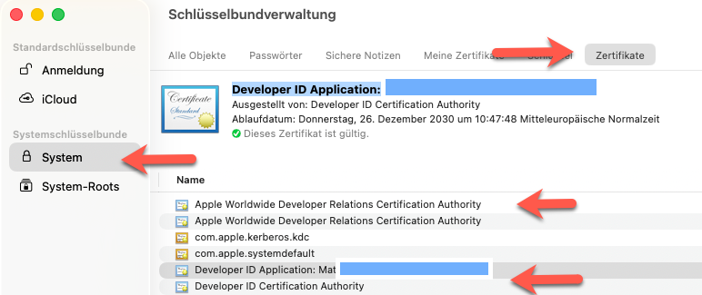

If the Developer ID Application is **not** available, then follow the instructions below.

---

<br/>

## ✅ Create a Developer ID Application Certificate

### Create a CSR File

Firstly, go to the KeyChain Application in MacOs an create a CSR. Open the menu certificate assistant.

Keychain Access → Certificate Assistant → Request a Certificate From a Certificate Authority…

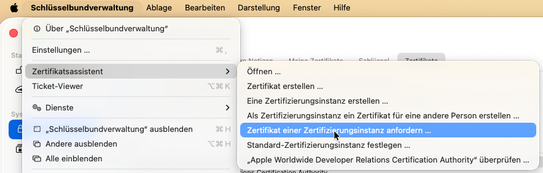

You enter your eMail address

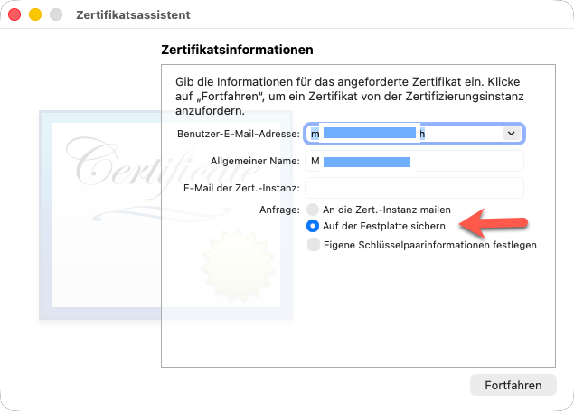

and then save the csr-file:

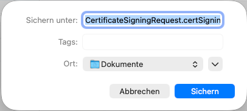

### Create the Certificate

Once signed up at https://developer.apple.com/account go to Account -> Certificates -> Click on the (+) button to add a new certificate.

You want to create a Developer ID Application certificate

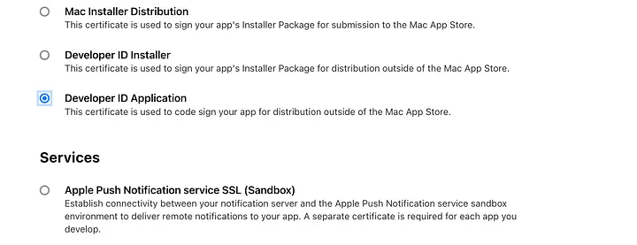

Go through the process of generating a certificate signing request.

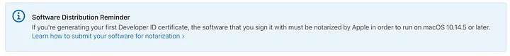

The key part here is ‘software that you sign it with must be notarized by Apple’ — we will come back to this part when we start packaging the application.

Download and install the certificate into your keychain.

Open up your keychain to determine the name of the certificate

Here you can check your created certificate:

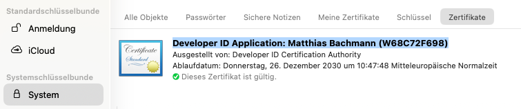

In the greyed-out box, you will see your certificate name and team ID.


https://developer.apple.com/account/resources/certificates/list

----

### Notarise app password
The last step in getting all of the components together is to get a notarised app password for this specific app that you will be building.

go to https://developer.apple.com/account/resources/identifiers/bundleId/add/bundle to add a new bundle for this application

Press enter or click to view image in full size

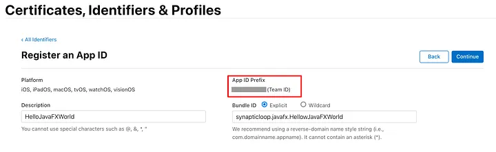

Type in the name HelloJavaFXWorld and the Bundle ID unitedportal.javafx.HelloJavaFXWorld.

Also note the team ID under the App ID Profile which will appear in the greyed-out box above

Click on the Continue button and then Register.

----

### App Specific Password

Now sign into https://appleid.apple.com/

go to https://appleid.apple.com/account/manage

and click on the App Specific Passwords link

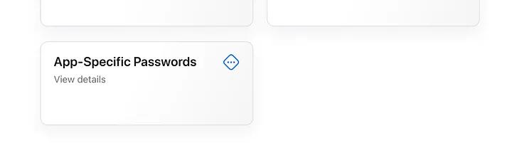


A pop up will be presented — click on the + button to add a new password.

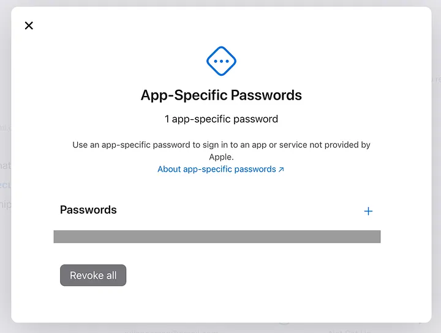

Yet another popup — enter the name NOTE: it does not have to be the same as your application name — but it helps to keep everything in line.

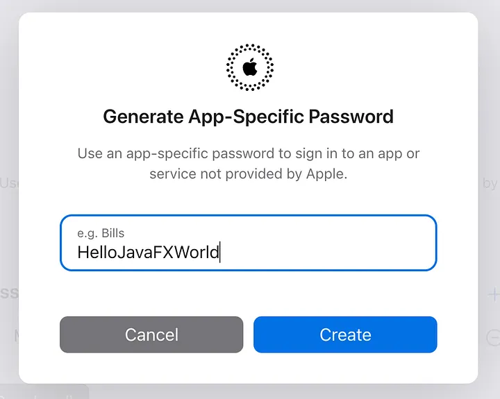

Click on Create — you will need to enter your developer ID password again.

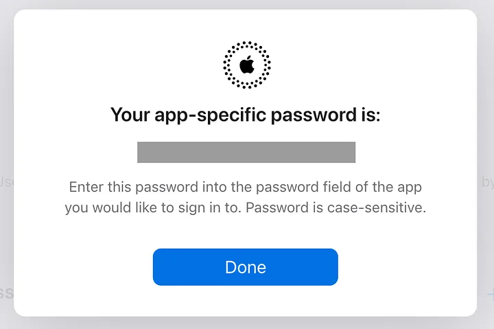

Save this password — you will never see this password again — if you lose it, you will have to regenerate it.

----

### Summary about Developer ID Application certificate

1. Create a **Developer ID Application certificate** in your Apple Developer account.
2. Download and install the certificate into your macOS Keychain.
3. Note your:
   - Certificate name → `MAC_SIGNING_KEY_NAME`
   - Team ID → `APPLE_TEAM_ID`
   - Apple ID → `APPLE_ID`
   - App-specific password → `APPLE_HELLO_JAVA_FX_WORLD_APP_PASSWORD`
   - The application bundleID

Add these to your `~/.zshrc` or `~/.bashrc` or `~/.bash_profile`:

```bash
export MAC_SIGNING_KEY_NAME="Developer ID Application: Your Name (TEAMID)"
export APPLE_ID="your-apple-id@example.com"
export APPLE_TEAM_ID="YOUR_TEAM_ID"
export APPLE_HELLO_JAVA_FX_WORLD_APP_PASSWORD="your-app-specific-password"
```

---
<br/>

## ✅ Project Setup (Maven) and modify the App

Create a Maven JavaFX project with your prefered IDE (example: `HelloJavaFXWorld`).

Here, for example, with IntelliJ:

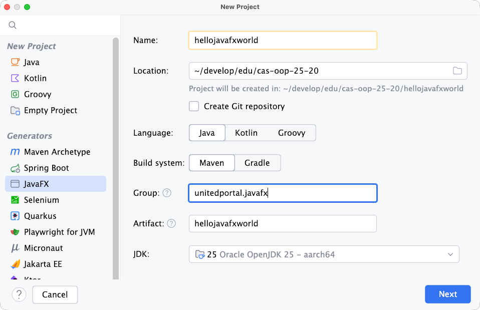

Ensure:
- JDK 25 with JavaFX modules.
- Remove `-SNAPSHOT` from version in `pom.xml`:
  ```xml
  <version>1.0.0</version>
  ```

Adapt the pom.xml file:

```xml

<project xmlns="http://maven.apache.org/POM/4.0.0"
         xmlns:xsi="http://www.w3.org/2001/XMLSchema-instance"
         xsi:schemaLocation="http://maven.apache.org/POM/4.0.0 http://maven.apache.org/xsd/maven-4.0.0.xsd">
    <modelVersion>4.0.0</modelVersion>

    <groupId>unitedportal.javafx</groupId>
    <artifactId>hellojavafxworld</artifactId>
    <version>1.0.0</version>
    <packaging>jar</packaging>

    <properties>
        <maven.compiler.release>25</maven.compiler.release>
        <project.build.sourceEncoding>UTF-8</project.build.sourceEncoding>
        <javafx.version>25</javafx.version>
        <javafx-maven-plugin.version>0.0.8</javafx-maven-plugin.version>
        <jpackage.plugin.version>1.7.1</jpackage.plugin.version>
        <junit.version>5.12.1</junit.version>
    </properties>

    <dependencies>
        <!-- JavaFX -->
        <dependency>
            <groupId>org.openjfx</groupId>
            <artifactId>javafx-controls</artifactId>
            <version>${javafx.version}</version>
        </dependency>
        <dependency>
            <groupId>org.openjfx</groupId>
            <artifactId>javafx-fxml</artifactId>
            <version>${javafx.version}</version>
        </dependency>

        <!-- Tests -->
        <dependency>
            <groupId>org.junit.jupiter</groupId>
            <artifactId>junit-jupiter</artifactId>
            <version>${junit.version}</version>
            <scope>test</scope>
        </dependency>
    </dependencies>

    <build>
        <plugins>
            <!-- Compiler -->
            <plugin>
                <groupId>org.apache.maven.plugins</groupId>
                <artifactId>maven-compiler-plugin</artifactId>
                <version>3.14.1</version>
                <configuration>
                    <release>${maven.compiler.release}</release>
                </configuration>
            </plugin>

            <!-- Jar Manifest mit Main-Class -->
            <plugin>
                <groupId>org.apache.maven.plugins</groupId>
                <artifactId>maven-jar-plugin</artifactId>
                <version>3.5.0</version>
                <configuration>
                    <archive>
                        <manifest>
                            <addClasspath>true</addClasspath>
                            <mainClass>unitedportal.javafx.hellojavafxworld.HelloApplication</mainClass>
                        </manifest>
                    </archive>
                </configuration>
            </plugin>

            <!-- Tests: JUnit 5 -->
            <plugin>
                <groupId>org.apache.maven.plugins</groupId>
                <artifactId>maven-surefire-plugin</artifactId>
                <version>3.5.4</version>
                <configuration>
                    <useModulePath>false</useModulePath>
                </configuration>
            </plugin>

            <!-- JavaFX: run + jlink -->
            <plugin>
                <groupId>org.openjfx</groupId>
                <artifactId>javafx-maven-plugin</artifactId>
                <version>${javafx-maven-plugin.version}</version>
                <configuration>
                    <mainClass>unitedportal.javafx.hellojavafxworld/unitedportal.javafx.hellojavafxworld.HelloApplication</mainClass>

                    <options>
                        <option>--enable-native-access=javafx.graphics</option>
                    </options>

                </configuration>
            <executions>
                    <execution>
                        <id>default-cli</id>
                        <goals>
                            <goal>jlink</goal>
                        </goals>
                        <configuration>
                            <launcher>app</launcher>
                            <mainClass>unitedportal.javafx.hellojavafxworld/unitedportal.javafx.hellojavafxworld.HelloApplication</mainClass>
                            <jlinkImageName>image</jlinkImageName>
                            <jlinkZipName>image</jlinkZipName>
                            <noManPages>true</noManPages>
                            <stripDebug>true</stripDebug>
                            <noHeaderFiles>true</noHeaderFiles>
                            <compress>2</compress>
                        </configuration>
                    </execution>
                </executions>
            </plugin>

            <plugin>
                <groupId>org.panteleyev</groupId>
                <artifactId>jpackage-maven-plugin</artifactId>
                <version>${jpackage.plugin.version}</version>
                <configuration>
                    <!-- Verwende das vom javafx-maven-plugin erzeugte Runtime-Image -->
                    <runtimeImage>${project.build.directory}/app</runtimeImage>
                    <mainJar>${project.build.finalName}.jar</mainJar>
                    <name>HelloJavaFXWorld</name>
                    <mainClass>unitedportal.javafx.hellojavafxworld/unitedportal.javafx.hellojavafxworld.HelloApplication</mainClass>
                    <appVersion>${project.version}</appVersion>
                    <!-- Für reine App-Images: -->
                    <type>app-image</type>
                    <javaOptions>
                        <javaOption>--enable-native-access=javafx.graphics</javaOption>
                        <javaOption>--add-opens=java.base/java.lang.reflect=ALL-UNNAMED</javaOption>
                    </javaOptions>

                    <!-- Optional: Installer statt App-Image
                    <type>exe</type>        - Windows
                    <type>msi</type>        - Windows
                    <type>pkg</type>        - macOS
                    <type>dmg</type>        - macOS
                    <type>deb</type>        - Linux
                    <type>rpm</type>        - Linux
                    -->

                    <!-- Optional: Icons etc.
                    <icon>src/main/resources/icon.ico</icon>
                    <vendor>Dein Name/Org</vendor>
                    <copyright>© 2025</copyright>
                    -->
                    <destination>target/jpackage</destination>
                </configuration>
            </plugin>
        </plugins>
    </build>
</project>

```

<br/>

And the `HelloApplication.java` file to support a slash screen:

```java
package unitedportal.javafx.hellojavafxworld;

import javafx.application.Application;
import javafx.application.Platform;
import javafx.fxml.FXMLLoader;
import javafx.scene.Scene;
import javafx.scene.input.KeyCode;
import javafx.stage.Stage;

import java.awt.*;
import java.io.IOException;

public class HelloApplication extends Application {
	@Override
	public void start(Stage stage) throws IOException {

		stage.setOnCloseRequest(evt -> {
			Platform.exit();
			new Thread(() -> {
				try { Thread.sleep(100); } catch (InterruptedException ignored) {}
				System.exit(0);
			}, "hard-exit").start();
		});

		var url = HelloApplication.class.getResource("hello-view.fxml");
		System.out.println("FXML URL = " + url);


		FXMLLoader fxmlLoader = new FXMLLoader(HelloApplication.class.getResource("hello-view.fxml"));
		Scene scene = new Scene(fxmlLoader.load(), 320, 240);

		scene.setOnKeyReleased(event -> {
			if (event.getCode() == KeyCode.Q && event.isMetaDown()) {
				System.out.println("exiting...");
				Platform.exit();
			}
		});

		stage.setTitle("Hello!");
		stage.setScene(scene);
		stage.show();

		SplashScreen splash = SplashScreen.getSplashScreen();
		if (splash != null) {
			splash.close();
		}
	}

	public static void main(String[] args) {
		launch();
	}
}

```

Run the App. The result should be:

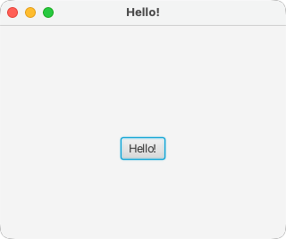

The spash screen is not yet displayed. The splash screen file will be copied later into the `HelloJavaFXWorld.app/Contents/app` folder.

---

<br/>

## ✅ Create Entitlements File

`src/packaging/entitlements.plist`:

```xml
<?xml version="1.0" encoding="UTF-8"?>
<!DOCTYPE plist PUBLIC "-//Apple//DTD PLIST 1.0//EN" "http://www.apple.com/DTDs/PropertyList-1.0.dtd">
<plist version="1.0">
<dict>
    <key>com.apple.security.app-sandbox</key><false/>
    <key>com.apple.security.network.server</key><true/>
    <key>com.apple.security.network.client</key><true/>
    <key>com.apple.security.files.user-selected.read-write</key><true/>
    <key>com.apple.security.cs.allow-jit</key><true/>
    <key>com.apple.security.cs.allow-unsigned-executable-memory</key><true/>
    <key>com.apple.security.cs.disable-library-validation</key><true/>
</dict>
</plist>
```
---

<br/>

## ✅ Put the Icons and the Splash Screen to src/packaging

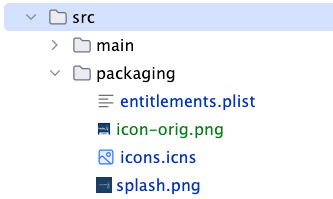

---

<br/>

## ✅ Scripts for jlink, jpackage, xcrun, codesign

The scripts can be found in `dist-mac.sh`. 

### Verify the environment variable

```bash
echo $MAC_SIGNING_KEY_NAME
echo $APPLE_ID
echo $APPLE_TEAM_ID
echo $APPLE_HELLO_JAVA_FX_WORLD_APP_PASSWORD
```

### Run the application

```bash
mvn clean javafx:run
```

### Build Runtime Image with jlink

Use Maven plugin or command:

```bash
mvn clean javafx:jlink
```

### Verify Runtime Image with jlink

```bash
target/image/bin/app
```

We are ready to jpackage

---

### Package App with jpackage

#### Create `.app` bundle:

```bash
jpackage \
  --verbose \
  --type app-image \
  --dest target/jpackage \
  --name HelloJavaFXWorld \
  --vendor "United-Portal" \
  --module unitedportal.javafx.hellojavafxworld/unitedportal.javafx.hellojavafxworld.HelloApplication \
  --icon src/packaging/icons.icns \
  --app-version 1.0.0 \
  --runtime-image target/image \
  --java-options "-splash:\$APPDIR/splash.png" \
  --mac-sign \
  --mac-entitlements src/packaging/entitlements.plist \
  --mac-signing-key-user-name "$MAC_SIGNING_KEY_NAME" \
  --mac-package-identifier unitedportal.javafx.hellojavafxworld
```

Copy splash image into `.app`:

```bash
cp src/packaging/splash.png target/jpackage/HelloJavaFXWorld.app/Contents/app
```

#### Re-Sign DMG

```bash
codesign \
  --entitlements src/packaging/entitlements.plist \
  -vvv \
  --options runtime \
  --force \
  --sign "$MAC_SIGNING_KEY_NAME" \
  target/jpackage/HelloJavaFXWorld.app
```

Verify the app 

```bash
open target/jpackage/HelloJavaFXWorld.app
```

#### Create DMG:

```bash
jpackage \
  --verbose \
  --type dmg \
  --dest target/jpackage \
  --name HelloJavaFXWorld \
  --app-image target/jpackage/HelloJavaFXWorld.app \
  --icon src/packaging/icons.icns \
  --mac-sign \
  --mac-signing-key-user-name "$MAC_SIGNING_KEY_NAME" \
  --mac-package-identifier unitedportal.javafx.hellojavafxworld \
  --mac-package-name HelloJavaFXWorld \
  --mac-entitlements src/packaging/entitlements.plist \
  --vendor unitedportal \
  --app-version 1.0.0 \
  --copyright "Copyright (c) 2026 United-Portal"```
```

---


### Notarize and Staple

```bash
xcrun \
  notarytool \
  submit \
  --apple-id $APPLE_ID \
  --team-id $APPLE_TEAM_ID \
  --password $APPLE_HELLO_JAVA_FX_WORLD_APP_PASSWORD \
  target/jpackage/HelloJavaFXWorld-1.0.0.dmg \
  --wait

xcrun \
  stapler \
  staple \
  target/jpackage/HelloJavaFXWorld-1.0.0.dmg
```

---

### Validate

```bash
spctl --assess --type open --verbose target/jpackage/HelloJavaFXWorld-1.0.0.dmg
```

Expected: `accepted`.

---

<br/>


## ✅ Summary

You now have:
- A signed and notarized `.dmg` ready for distribution.
- A JavaFX app that runs without Gatekeeper warnings.
